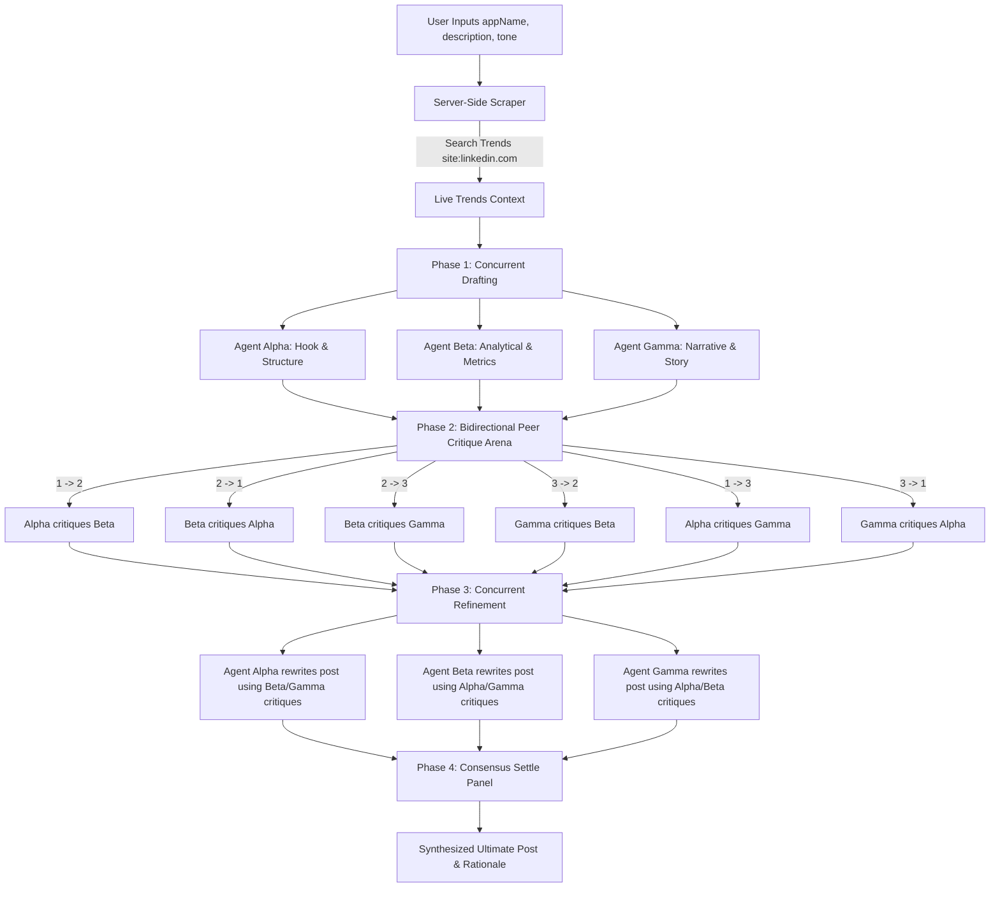

# Virality Mapper - 3-Agent LinkedIn Debate Arena 🚀

An advanced, premium multi-agent LinkedIn post workspace inspired by collaborative human brainstorming. Instead of using pre-defined static personas with a simple single-pass Judge, the system runs **three specialist copywriting agents** concurrently, exposes their drafts to a **bidirectional peer review critique arena**, refines the posts using peer feedback, and synthesizes the absolute best possible viral outcome grounded by **real-time LinkedIn search trends**.

---

## 🏗️ System Architecture & Debate Flow

The core of Virality Mapper is its multi-phase consensus and debate architecture, which mimics a high-performance marketing brainstorm:



### Phase 1: Real-Time Trend Grounding & Drafting
- **Scraper Module**: The Next.js API route runs a server-side DuckDuckGo search query targeting `site:linkedin.com` posts related to the user's topic.
- **Drafting**: The live search trends are fed into the system context. The three specialist agents generate their initial drafts concurrently:
  - **Agent Alpha (Hook & Structure)**: Specializes in scroll-stopping pattern-interrupt hooks, crisp visual breaks, and maximized CTR.
  - **Agent Beta (Analytical & Metrics)**: Focuses on checklists, bold numbers, clear business metrics, and raw value.
  - **Agent Gamma (Narrative & Story)**: Employs the hero's journey, lessons learned, and brand vulnerability.

### Phase 2: Bidirectional Peer Critique Arena
Rather than selecting a draft immediately, the three agents enter a bidirectional critique loop where each agent acts as a reviewer for both of their peers:
1. **Agent Alpha** evaluates and critiques **Agent Beta** (1 → 2) and **Agent Gamma** (1 → 3).
2. **Agent Beta** evaluates and critiques **Agent Alpha** (2 → 1) and **Agent Gamma** (2 → 3).
3. **Agent Gamma** evaluates and critiques **Agent Alpha** (3 → 1) and **Agent Beta** (3 → 2).

Each review scores the draft out of 100 and outlines structural, metric-based, or storytelling critiques.

### Phase 3: Refinement Cycle
Each agent receives the evaluations from their two peers and refines their original post to implement suggested updates, outputting their revised post alongside a change log argument explaining their edits.

### Phase 4: Consensus Settle Panel
The 3 refined drafts, their critique histories, and self-change arguments are consolidated in a final consensus call. The panel acts as a master editor, combining the best pattern-interrupt hooks, metric sections, and narrative sequences into a single copy-ready post.

---

## ✨ Key Features

- **Live Trend Grounding**: Automatically searches the web to extract what hook styles and keywords are currently performing on LinkedIn for your specific topic.
- **Dynamic Model Selection**: Connect your credentials and dynamically pull the list of active models directly from the provider.
- **Debate Customization**: Customize prompts, temperature values, providers, and models for each of the three copywriting agents. They can all run on the same API key/model (e.g. Gemini) or distinct providers (Gemini, OpenAI, Anthropic, Ollama, etc.) for a true multi-model debate.
- **Diverse LLM Providers**:
  - **Cloud**: Google Gemini, OpenAI, Anthropic
  - **Router**: OpenRouter (Groq, DeepSeek, Together AI, Mistral)
  - **Local**: Ollama and LM Studio (via local developer REST endpoints)
  - **Custom**: Any custom OpenAI-compatible endpoint.
- **In-App Credentials Manager**: Manage API keys and endpoints securely inside the UI (cached in `localStorage`). No keys are saved on a database or backend.
- **Interactive Timeline Logs**: Redesigned Results view featuring sub-tabs to inspect:
  - *Phase 1: Initial Drafts* (showing initial drafts and their hook strategies).
  - *Phase 2: Critique Arena* (showing all 6 peer critique ratings and comments).
  - *Phase 3: Refined Drafts* (showing the rewritten posts and change arguments).
- **Vercel-Inspired Minimalist UI**: Typographic dark theme focusing on precise whitespace, clean monospace layouts, thin borders, and structured grids.

---

## 🛠️ Tech Stack

- **Frontend**: Next.js (App Router), React, Lucide Icons, Vanilla CSS (Geist typographic style system)
- **Backend**: Next.js API Routes, dynamic LLM proxy integrations (`@google/genai`, `@anthropic-ai/sdk`, `openai`)

---

## 💻 Getting Started

### Prerequisites
- Node.js (v18 or higher)
- npm

### Installation & Run

1. **Clone the repository and install dependencies**:
   ```bash
   cd Virality-Mapper
   npm install
   ```

2. **Run the development server**:
   ```bash
   npm run dev
   ```

3. **Open the workspace**:
   Navigate to [http://localhost:3000](http://localhost:3000) in your browser.

---

## 🧠 How to Use the App

1. **Configure Credentials**: 
   Go to the **Settings** tab in the sidebar and enter your API keys (Gemini, OpenAI, etc.). Use the **Test** button to verify the connection is successful.
2. **Customize Agents**: 
   Go to the **Agent Playground** tab to configure your 3 debate agents. Adjust their temperature values, assign different provider endpoints, or modify their system prompt guidelines.
3. **Draft & Trigger Arena**: 
   Go to the **Workspace** tab, input your project details (name, description, target audience, writing tone), and click **Run 3-Agent Debate Arena**.
4. **Inspect the Arena**: 
   Watch the live debate flow compile. Once complete, copy the finalized Consolidated Master Post, and browse through the **Debate Arena Logs** tab panels to see exactly how your post was argued and refined!
